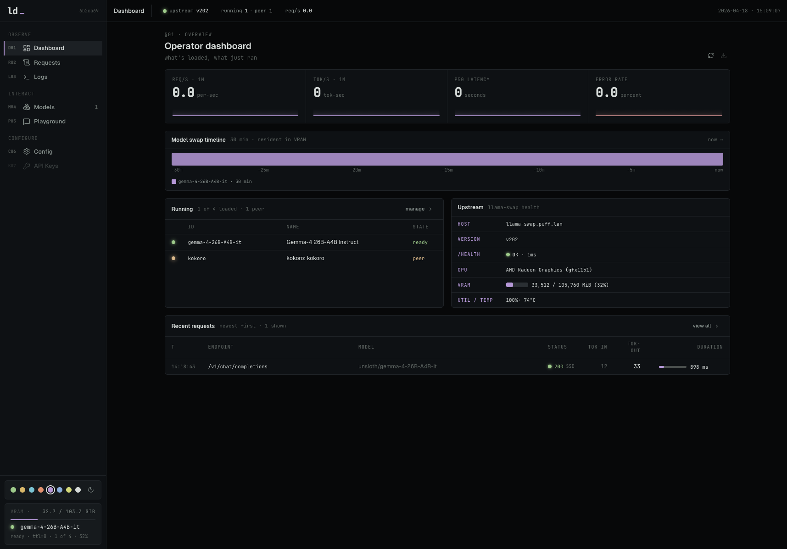

# llama-dash

A sidecar dashboard and proxy for [llama-swap](https://github.com/mostlygeek/llama-swap). Requires a running llama-swap instance — llama-dash does not run inference itself. It sits in front of llama-swap as the single public-facing endpoint, adding a management UI and proxy-layer features that llama-swap doesn't provide on its own:

- **Dashboard** — live stats (req/s, tok/s, p50, error rate) with sparklines, model swap timeline, running models with peer support, upstream health + GPU monitoring.
- **Model management** — load/unload models from the UI, see running state and peer connections.
- **Request logging** — every `/v1/*` call logged to SQLite (method, endpoint, model, status, duration, token counts), with a searchable/filterable UI, histogram, and per-request detail view.
- **Transparent proxy** — forwards all `/v1/*` traffic to llama-swap with streaming SSE preserved. Token counts are scraped from responses as they pass through, without buffering.
- **GPU monitoring** — auto-detects NVIDIA, AMD, or Apple Silicon GPUs. Shows VRAM/GTT usage, utilization, temperature, power. Sidebar shows live VRAM bar.
- **Config editor** — edit llama-swap's `config.yaml` from the UI with validation; llama-swap picks up changes via file watch.

<table>
  <tr>
    <td colspan="3">
      Screenshots
    </td>
  </tr>
  <tr>
    <td>
      
    </td>
    <td>
      
    </td>
    <td>
      
    </td>
  </tr>
</table>

```
client ──► llama-dash :5173 ──► llama-swap (internal) ──► llama-server processes
           │
           ├─ UI (/)
           ├─ Admin API (/api/*)
           └─ Proxy (/v1/*)
```

Clients point at llama-dash instead of llama-swap directly. In Docker Compose, llama-swap is on an internal network and not exposed to the host.

## Quick start (Docker Compose)

```bash
cp config/config.example.yaml config/config.yaml  # edit models
docker compose up -d
# open http://localhost:5173
```

The compose file runs llama-swap (with `-watch-config` for hot reload) and llama-dash together. GPU models are stored in `./models/`, config in `./config/config.yaml`.

By default the compose file is set up for AMD GPUs (`/dev/kfd`, `/dev/dri`). For NVIDIA, swap the image tag to `:cuda` and uncomment the `deploy.resources` block — see comments in `docker-compose.yaml`.

## Manual setup

### Requirements

- Node 22+
- pnpm
- A reachable [llama-swap](https://github.com/mostlygeek/llama-swap) instance

### Install

```bash
cp .env.example .env   # edit LLAMASWAP_URL to point at your instance
pnpm install
pnpm db:migrate        # creates data/dash.db
pnpm dev               # http://localhost:5173
```

## Environment

Copy `.env.example` to `.env` and fill in the values.

| Var | Default | Notes |
|---|---|---|
| `LLAMASWAP_URL` | `http://localhost:8080` | Upstream llama-swap base URL. No trailing slash. |
| `LLAMASWAP_INSECURE` | `false` | Skip TLS verification for upstream with self-signed certs. |
| `LLAMASWAP_CONFIG_FILE` | (empty) | Absolute path to llama-swap's `config.yaml`. Required for config editor. |
| `DATABASE_PATH` | `data/dash.db` | SQLite file, relative to CWD. |

## How it's wired

- `src/server/proxy/*` — the `/v1/*` pass-through: streaming SSE preserved, token counts scraped from the response as it flies by, one row per request written to SQLite on completion.
- `src/server/admin/*` — the `/api/*` admin surface consumed by the UI (models, requests, stats, histogram, health, GPU, model-timeline).
- `src/server/gpu-poller.ts` — polls `nvidia-smi` / `rocm-smi` / `system_profiler` every 10s, caches result in memory. AMD APUs use GTT (not VRAM) for actual usable memory.
- `src/server/model-watcher.ts` — polls llama-swap `/running` every 15s, diffs state, writes load/unload events to `model_events` table.
- `src/server/llama-swap/client.ts` — typed client over llama-swap's HTTP API.
- `src/server/vite-plugin.ts` — mounts handlers + starts pollers as Vite dev-server middleware. Production packaging (Nitro / Docker) is not part of this first pass.
- `src/routes/*` — TanStack Start routes: `/`, `/models`, `/requests`, `/logs`.
- `src/lib/queries.ts` — TanStack Query hooks with 5s polling for live updates.

## Useful scripts

```bash
pnpm dev           # dev server (:5173)
pnpm db:generate   # emit a new drizzle migration from the schema
pnpm db:migrate    # apply pending migrations
pnpm db:studio     # drizzle-kit studio

pnpm lint          # biome lint .
pnpm lint:fix      # biome lint --write .
pnpm format        # biome format .
pnpm format:fix    # biome format --write .
pnpm check         # biome check --write . (lint + format + import sort)
pnpm typecheck     # tsgo --noEmit
```

Run `lint:fix`, `format:fix`, and `typecheck` before calling any change
done — see `AGENTS.md`.

## Acknowledgements

This project was developed with significant assistance from LLMs, primarily [Claude Code](https://claude.ai/claude-code) (Anthropic). Architecture decisions, implementation, and documentation were all shaped through human-AI collaboration.

## License

MIT
