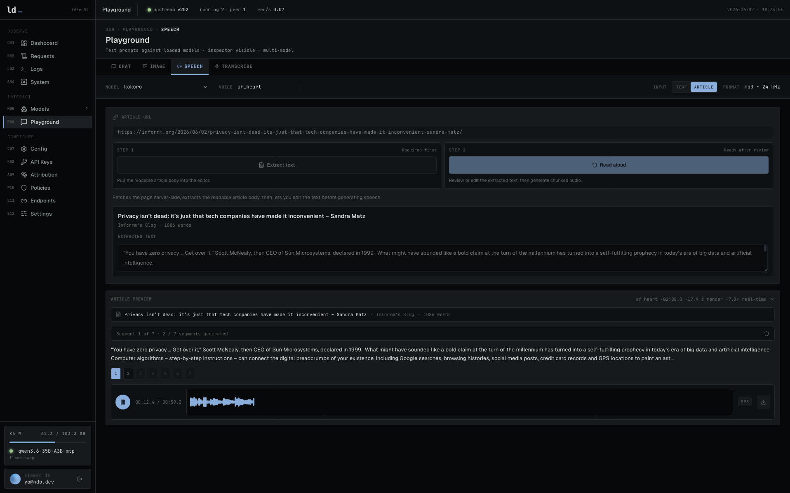
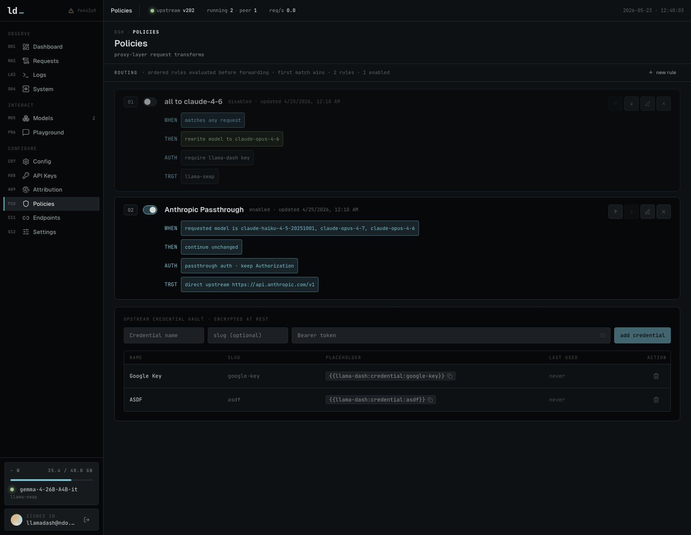

<h1>
  
  &nbsp;llama-dash
</h1>


llama-dash turns a self-hosted local inference box into an observable, policy-controlled AI gateway: one UI for model state, request history, API keys, routing rules, proxy metrics, and client setup. The implemented inference backend is currently [llama-swap](https://github.com/mostlygeek/llama-swap) over llama.cpp.

It is the single public entrypoint for OpenAI-compatible and Anthropic-compatible clients. llama-dash owns proxy policy, logging, auth, routing, and backend normalization, your selected inference backend owns local model processes and inference when traffic is routed to local models.

```text
OpenAI SDK / Claude Code / Continue / Open WebUI
                    │
                    ▼
              llama-dash :3000
      dashboard · auth · logs · routing · metrics
             │                     │
             ▼                     ▼
      llama-swap :8080         direct /v1 upstreams
  llama.cpp models · peers      OpenAI · Anthropic
```

## ✨ What it does

- **Watch the box** — live request, token, model, upstream, GPU, and update status in one dashboard.
- **Manage models** — load/unload models, inspect per-model stats, view residency history, and edit llama-swap config with validation.
- **Proxy clients** — expose one OpenAI/Anthropic-compatible `/v1/*` endpoint for local models, peers, direct upstreams, Claude Code, Continue, Open WebUI, and more.
- **Track requests** — searchable request history with filters, histograms, detail views, attribution metadata, token counts, and cost estimates.
- **Control access** — dashboard login, hashed API keys, per-key RPM/TPM limits, model allow-lists, MCP relay allow-lists, and per-key usage breakdowns.
- **Enforce policy** — routing rules for model rewrites, rejects, passthrough auth, direct HTTPS upstreams, encrypted credentials, system prompts, and global request size limits.
- **Test models** — playgrounds for chat, image, speech, and transcription, including article-to-speech extraction.
- **Export ops data** — raw log streams, retention controls, request auditing, and low-cardinality Prometheus metrics at `/metrics`.

<table>
  <tr>
    <td align="center" valign="top">
      <sub><strong>Dashboard</strong><br />Live traffic, tokens, model residency, upstream and GPU health</sub>
    </td>
    <td align="center" valign="top">
      <sub><strong>Playground</strong><br />Chat against local endpoints with request/response inspection</sub>
    </td>
    <td align="center" valign="top">
      <sub><strong>Request detail</strong><br />Routing, attribution, latency, tokens, and payload metadata</sub>
    </td>
    <td align="center" valign="top">
      <sub><strong>Logs</strong><br />Raw llama-swap, proxy, and upstream streams in one viewer</sub>
    </td>
  </tr>
  <tr>
    <td valign="top">
      
    </td>
    <td valign="top">
      
    </td>
    <td valign="top">
      
    </td>
    <td valign="top">
      
    </td>
  </tr>
  <tr>
    <td align="center" valign="top">
      <sub><strong>Model detail</strong><br />Load history, stats, recent requests, and config context</sub>
    </td>
    <td align="center" valign="top">
      <sub><strong>Speech playground</strong><br />Read any article and audio testing</sub>
    </td>
    <td align="center" valign="top">
      <sub><strong>Policies</strong><br />Aliases, routing rules, passthrough auth, and request limits</sub>
    </td>
    <td align="center" valign="top">
      <sub><strong>Requests</strong><br />Searchable history with filters, sorting, and histogram</sub>
    </td>
  </tr>
  <tr>
    <td valign="top">
      
    </td>
    <td valign="top">
      
    </td>
    <td valign="top">
      
    </td>
    <td valign="top">
      
    </td>
  </tr>
</table>


## ⚡ Quick start (Docker Compose)

Choose the compose file that matches your GPU vendor. Both setups use `./config/config.yaml` for llama-swap config, `./models/` for model files, and expose llama-dash on `http://localhost:3000`.

### AMD / ROCm

```bash
cp config/config.example.yaml config/config.yaml  # edit models
docker compose -f docker-compose.amd.yaml up -d
```

`docker-compose.amd.yaml` runs `ghcr.io/mostlygeek/llama-swap:rocm`, passes through `/dev/kfd` and `/dev/dri`, and also mounts `/dev/dri` into llama-dash so AMD GPU stats work in the dashboard.

### NVIDIA / CUDA

```bash
cp config/config.example.yaml config/config.yaml  # edit models
docker compose -f docker-compose.nvidia.yaml up -d
```

`docker-compose.nvidia.yaml` runs `ghcr.io/mostlygeek/llama-swap:cuda` and requests `gpus: all` for the llama-swap service. This requires the NVIDIA Container Toolkit on the host.

## 🏗️ Manual setup

### Requirements

- Node 24+
- pnpm
- A reachable [llama-swap](https://github.com/mostlygeek/llama-swap) instance

### Install

```bash
cp .env.example .env   # edit INFERENCE_BASE_URL to point at your instance
pnpm install
pnpm db:migrate        # creates data/dash.db
pnpm dev               # http://localhost:5173
```

## 🏔️ Environment

Copy `.env.example` to `.env` and fill in the values.

| Variable | Default | Notes |
|---|---|---|
| `INFERENCE_BACKEND` | `llama-swap` | Active inference backend. Only `llama-swap` is currently implemented. |
| `INFERENCE_BASE_URL` | `http://localhost:8080` | Inference backend base URL. No trailing slash. |
| `INFERENCE_INSECURE` | `false` | Skip TLS verification for inference backend with self-signed certs. |
| `INFERENCE_CONFIG_FILE` | (empty) | Absolute path to the backend config file. Required for the llama-swap config editor. |
| `DATABASE_PATH` | `data/dash.db` | SQLite file, relative to CWD. SQLite `:memory:` and `file:` URI paths are preserved for tests/special deployments. |
| `BETTER_AUTH_SECRET` | | Secret for signing Better Auth session data; `openssl rand -base64 33` |
| `BETTER_AUTH_URL` | inferred | Optional external base URL for Better Auth redirects/cookies. Set this to the public HTTPS origin when using passkeys outside localhost. |
| `CREDENTIAL_ENCRYPTION_KEY` | | 32+ character secret used to encrypt stored upstream provider credentials. Required before creating, placeholder-replacing, or injecting upstream credentials. |
| `UPSTREAM_HEADERS_TIMEOUT_MS` | `600000` | Upstream proxy fetch headers timeout (ms); `0` disables. Keep generous for long non-streaming jobs (image gen) that send no response headers until done. |
| `UPSTREAM_BODY_TIMEOUT_MS` | `0` | Upstream proxy fetch body timeout (ms); `0` disables. |

See [`docs/2026_05_03_inference_backends.md`](./docs/2026_05_03_inference_backends.md) for the backend abstraction, capability model, and future Ollama notes.

## ⚙️ How it's wired

- `src/server/proxy/*` — the `/v1/*` pass-through: streaming SSE preserved, proxy context/body snapshots kept isolated, bounded request/response capture for logs, token counts scraped from responses as they fly by, and one queued SQLite row per completed request.
- `src/server/pricing.ts` — startup-cached `models.dev` model pricing used to estimate logged request cost from upstream usage counters.
- `src/server/admin/*` — the `/api/*` admin surface consumed by the UI, with grouped route modules under `src/server/admin/routes/*` for models, requests, config, keys, aliases, routing, MCP relays, upstream credentials, settings, and system health. JSON GET responses support conditional ETag polling, `/api/events` streams lightweight dashboard events, and `/api/log-events` streams llama-swap logs only while the Logs page is mounted.
- `src/server/article-extract.ts` — server-side article URL fetcher for the Speech playground. It validates public HTTP(S) URLs, caps HTML fetch size/time, parses readable article text with Readability, and returns editable text for TTS.
- `src/server/mcp-relay/*` — configured `/mcp-relays/:slug` reverse proxies for coding-agent MCP HTTP transports. Relays require `x-llama-dash-api-key`, the key must allow the relay, stored upstream credentials are injected into outbound headers, responses stream through, and the exchange is logged without exposing provider secrets. Successful relay requests are metadata-only by default; failures keep the normal bounded debug capture policy.
- `src/server/auth.ts` — Better Auth setup for dashboard username/password and passkey sessions; protects UI and `/api/*`, not `/v1/*`. Signup is only allowed while no dashboard user exists.
- `src/server/gpu-poller.ts` — polls `nvidia-smi` / `rocm-smi` / `system_profiler` every 10s, caches result in memory, and publishes GPU-change events for live dashboard refresh. AMD APUs use GTT (not VRAM) for actual usable memory; Apple shows unified memory and core count when available.
- `src/server/model-watcher.ts` — polls the inference backend running-model capability every 15s, diffs state, writes load/unload events to `model_events` table, and publishes model-change events.
- `src/server/inference/*` — selected inference backend facade plus backend-specific adapters and hints.
- `src/server/llama-swap/client.ts` — typed client over llama-swap's HTTP API.
- `src/server/db/*` — Drizzle schema, SQLite initialization, and request/model-event indexes for common dashboard query paths. Apply migrations explicitly with `pnpm db:migrate`.
- `src/server/request-log-maintenance.ts` — hourly request-log retention cleanup plus manual prune/compact admin actions to keep the SQLite file bounded on high-frequency relay traffic.
- `src/server/metrics.ts` — Prometheus text metrics for proxy requests, tokens, latency window gauges, queue depth/drops, upstream reachability, running models, and GPU gauges at `/metrics`.
- `Dockerfile`, `prod-server.mjs`, `docker-compose.amd.yaml`, `docker-compose.nvidia.yaml` — production container packaging for llama-dash by itself or bundled with llama-swap.
- `src/routes/*` — thin TanStack Start route entrypoints for `/`, `/login`, `/models`, `/models/:id`, `/requests`, `/logs`, `/system`, `/playground`, `/config`, `/settings`, `/keys`, `/keys/:id`, `/attribution`, `/policies`, `/endpoints`.
- `src/features/*` — feature-local page components and helpers grouped by route area (`dashboard`, `requests`, `keys`, `models`, `playground`, etc.).
- `src/lib/queries.ts` — TanStack Query hooks with SSE-driven cache invalidation for request, model, GPU, and system changes plus slow ETag polling fallback.

## ✴️ Claude Code / Anthropic passthrough

Route any Anthropic SDK (including claude-code) through llama-dash for
logging, filtering, and per-request inspection. Supports Anthropic subscriptions. Traffic flows:

```
Claude Code ──► llama-dash :5173 (log + filter) ──► api.anthropic.com
```

**Client config** (`~/.claude/settings.json`):

```json
{
  "env": {
    "ANTHROPIC_BASE_URL": "http://<llama-dash-host>:3000",
    "CLAUDE_CODE_ENABLE_GATEWAY_MODEL_DISCOVERY": "1"
  }
}
```

Leave `ANTHROPIC_AUTH_TOKEN` unset when using subscription OAuth — Claude
Code manages the bearer itself and llama-dash passes it through unchanged.

In llama-dash, configure an explicit routing rule in Policies for `/v1/*`
target path or Claude source model names, using `continue`, `passthrough` auth, preserved client
`Authorization`, and direct target `https://api.anthropic.com/v1`. This
will result in all Anthropic requests being transparently proxied through
while logging all traffic in llama-dash and applying filters.

For provider-key flows, store the upstream token in the Policies credential
vault and add a credential binding to the routing rule. Bindings can either
set an outbound header automatically or replace a client-sent header
placeholder like `{{llama-dash:credential:anthropic-prod}}`; injected values
are redacted from request logs. The request detail view records non-secret
credential name/slug metadata for audit, and the credential vault warns before
deleting credentials still referenced by routing rules or MCP relays.
Credential-bearing passthrough rules still require a valid llama-dash API key;
they are not evaluated as pre-auth public passthrough rules.

For remote MCP servers, create an MCP relay in Policies instead of pointing
Claude Code directly at the provider. Configure Claude with the relay URL and a
separate llama-dash key header:

```json
{
  "mcpServers": {
    "hyperline_sandbox": {
      "type": "http",
      "url": "http://<llama-dash-host>:5173/mcp-relays/hyperline-sandbox",
      "headers": {
        "x-llama-dash-api-key": "sk-..."
      }
    }
  }
}
```

The provider bearer token stays encrypted in llama-dash and is injected only
when an API key that is explicitly allowed to use the relay forwards the MCP
request upstream. The Policies page shows this Claude Code snippet for each
configured relay.

## 🤖 Acknowledgements

This project was developed with significant assistance from LLMs. Architecture decisions, implementation, and documentation were all shaped through human-AI collaboration.

## 📝 License

MIT
