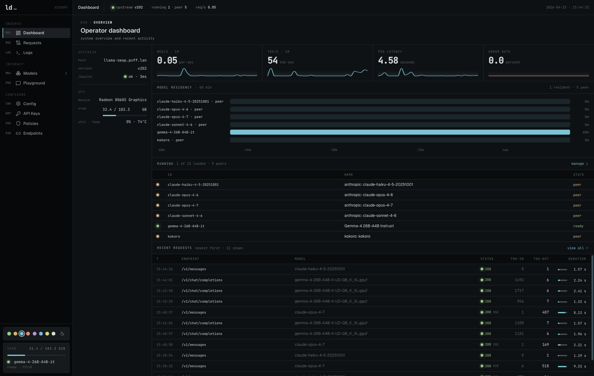
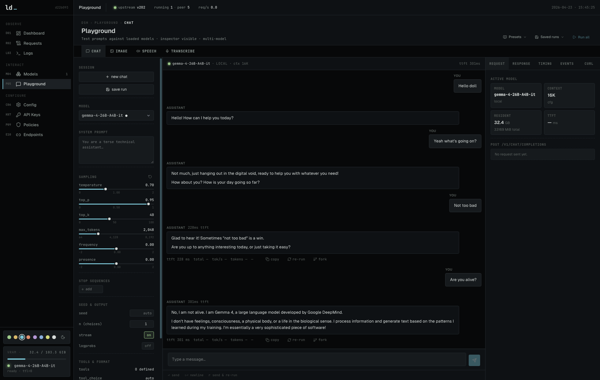
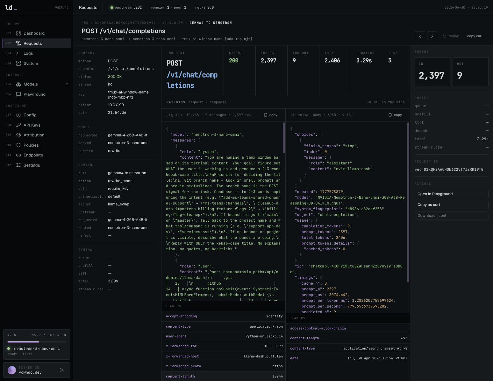
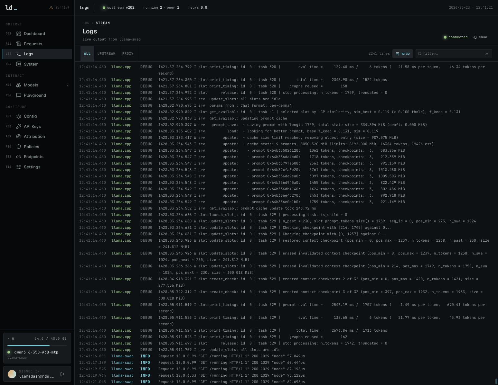
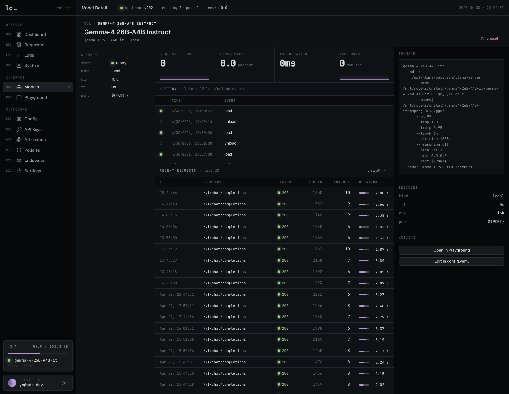
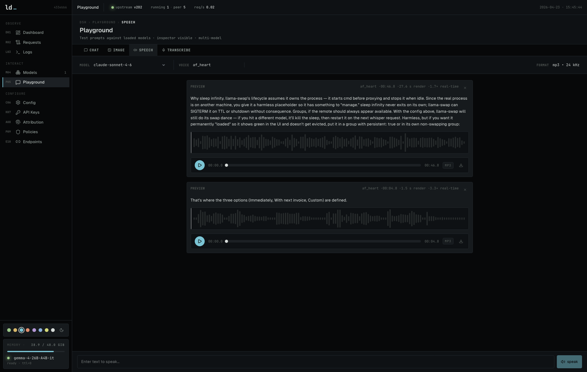
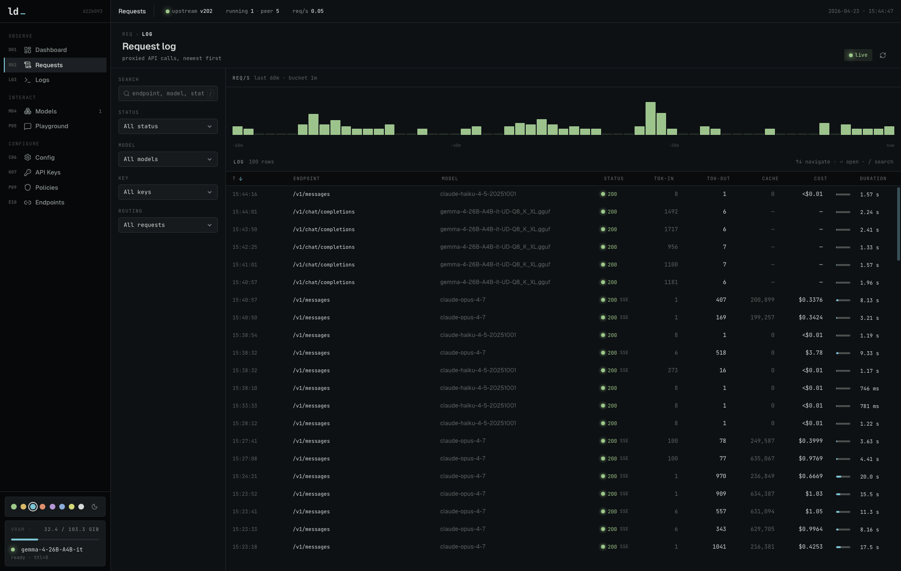

<h1>
  
  &nbsp;llama-dash
</h1>



Alternative dashboard and proxy on top of [llama-swap](https://github.com/mostlygeek/llama-swap) with many additional features including:

- **Dashboard** — live stats, sparklines, model timeline, upstream health, GPU monitoring.
- **Model management** — load/unload models, per-model stats, load history, config snippet.
- **Request logging** — every completed `/v1/*` call is queued for SQLite logging with searchable UI, histogram, and detail view.
- **Transparent proxy** — streaming SSE preserved, bounded body capture for logs, token counts scraped in-flight. OpenAI (`/v1/chat/completions`) and Anthropic (`/v1/messages`, `/v1/messages/count_tokens`) shapes both supported — point Claude Code at llama-dash via `ANTHROPIC_BASE_URL` to proxy and track your Claude code usage as well.
- **API keys** — per-key rate limits (RPM/TPM), model allow-lists editable from detail page, hashed at rest, per-key stats and model usage breakdown.
- **Dashboard auth** — Better Auth username/password and passkey session gate for the UI and `/api/*` with first-visit signup; `/v1/*` proxy auth stays API-key based.
- **Policies** — ordered routing rules with real proxy enforcement for continue, model rewrite, and policy reject actions, plus explicit auth passthrough and direct HTTPS `/v1` upstream targets for bearer/OAuth flows, per-key system prompt injection, and global request size limits.
- **Attribution** — configurable header mapping for client, end-user, and session metadata with setup examples for common clients.
- **Request auditing** — per-key usage tracking across all proxied calls.
- **Prometheus metrics** — `/metrics` exposes proxy request, token, latency-window, queue, upstream, running-model, and GPU gauges.
- **GPU monitoring** — NVIDIA, AMD, and Apple Silicon. VRAM, utilization, temp, power.
- **Config editor** — edit llama-swap `config.yaml` in-browser with on-demand validation, enforced pre-save schema checks, and auto-reload.
- **Endpoints** — copyable base URL, API key selector, code examples for curl, Python, TypeScript, Home Assistant, Claude Code, opencode, Continue, Open WebUI.
- **Playground** — Supports chat, image, speech and transcribe. See request/response/event tabs plus TTFT, prefill, decode, and stream-close timing when the upstream exposes llama.cpp timing metadata.
- **Settings** — application appearance controls and the home for global proxy/privacy defaults.

<table>
  <tr>
    <td align="center">
      Dashboard
    </td>
    <td align="center">
      Playground - Chat
    </td>
    <td align="center">
      Request Details
    </td>
    <td align="center">
      Logs
    </td>
  </tr>
  <tr>
    <td>
      
    </td>
    <td>
      
    </td>
    <td>
      
    </td>
    <td>
      
    </td>
  </tr>
  <tr>
    <td align="center">
      Model Details
    </td>
    <td align="center">
      Playground - Speech
    </td>
    <td align="center">
      Policies
    </td>
    <td align="center">
      Requests
    </td>
  </tr>
  <tr>
    <td>
      
    </td>
    <td>
      
    </td>
    <td>
      
    </td>
    <td>
      
    </td>
  </tr>
</table>


## Quick start (Docker Compose)

Choose the compose file that matches your GPU vendor. Both setups use `./config/config.yaml` for llama-swap config, `./models/` for model files, and expose llama-dash on `http://localhost:3000`.

### AMD / ROCm

```bash
cp config/config.example.yaml config/config.yaml  # edit models
docker compose -f docker-compose.amd.yaml up -d
```

`docker-compose.amd.yaml` runs `ghcr.io/mostlygeek/llama-swap:rocm`, passes through `/dev/kfd` and `/dev/dri`, and also mounts `/dev/dri` into llama-dash so AMD GPU stats work in the dashboard.

### NVIDIA / CUDA

```bash
cp config/config.example.yaml config/config.yaml  # edit models
docker compose -f docker-compose.nvidia.yaml up -d
```

`docker-compose.nvidia.yaml` runs `ghcr.io/mostlygeek/llama-swap:cuda` and requests `gpus: all` for the llama-swap service. This requires the NVIDIA Container Toolkit on the host.

## Manual setup

### Requirements

- Node 24+
- pnpm
- A reachable [llama-swap](https://github.com/mostlygeek/llama-swap) instance

### Install

```bash
cp .env.example .env   # edit LLAMASWAP_URL to point at your instance
pnpm install
pnpm db:migrate        # creates data/dash.db
pnpm dev               # http://localhost:5173
```

## Environment

Copy `.env.example` to `.env` and fill in the values.

| Var | Default | Notes |
|---|---|---|
| `LLAMASWAP_URL` | `http://localhost:8080` | Upstream llama-swap base URL. No trailing slash. |
| `LLAMASWAP_INSECURE` | `false` | Skip TLS verification for upstream with self-signed certs. |
| `LLAMASWAP_CONFIG_FILE` | (empty) | Absolute path to llama-swap's `config.yaml`. Required for config editor. |
| `DATABASE_PATH` | `data/dash.db` | SQLite file, relative to CWD. SQLite `:memory:` and `file:` URI paths are preserved for tests/special deployments. |
| `BETTER_AUTH_SECRET` | generated by Better Auth if unset | Secret for signing Better Auth session data; set a long random value for persistent deployments. |
| `BETTER_AUTH_URL` | inferred | Optional external base URL for Better Auth redirects/cookies. Set this to the public HTTPS origin when using passkeys outside localhost. |

## How it's wired

- `src/server/proxy/*` — the `/v1/*` pass-through: streaming SSE preserved, proxy context/body snapshots kept isolated, bounded request/response capture for logs, token counts scraped from responses as they fly by, and one queued SQLite row per completed request.
- `src/server/admin/*` — the `/api/*` admin surface consumed by the UI, with grouped route modules under `src/server/admin/routes/*` for models, requests, config, keys, aliases, routing, settings, and system health.
- `src/server/auth.ts` — Better Auth setup for dashboard username/password and passkey sessions; protects UI and `/api/*`, not `/v1/*`. Signup is only allowed while no dashboard user exists.
- `src/server/gpu-poller.ts` — polls `nvidia-smi` / `rocm-smi` / `system_profiler` every 10s, caches result in memory, and feeds dashboard/System GPU details. AMD APUs use GTT (not VRAM) for actual usable memory; Apple shows unified memory and core count when available.
- `src/server/model-watcher.ts` — polls llama-swap `/running` every 15s, diffs state, writes load/unload events to `model_events` table.
- `src/server/llama-swap/client.ts` — typed client over llama-swap's HTTP API.
- `src/server/db/*` — Drizzle schema, SQLite initialization, and request/model-event indexes for common dashboard query paths. Apply migrations explicitly with `pnpm db:migrate`.
- `src/server/metrics.ts` — Prometheus text metrics for proxy requests, tokens, latency window gauges, queue depth/drops, upstream reachability, running models, and GPU gauges at `/metrics`.
- `Dockerfile`, `prod-server.mjs`, `docker-compose.amd.yaml`, `docker-compose.nvidia.yaml` — production container packaging for llama-dash by itself or bundled with llama-swap.
- `src/routes/*` — thin TanStack Start route entrypoints for `/`, `/login`, `/models`, `/models/:id`, `/requests`, `/logs`, `/system`, `/playground`, `/config`, `/settings`, `/keys`, `/keys/:id`, `/attribution`, `/policies`, `/endpoints`.
- `src/features/*` — feature-local page components and helpers grouped by route area (`dashboard`, `requests`, `keys`, `models`, `playground`, etc.).
- `src/lib/queries.ts` — TanStack Query hooks with 5s polling for live updates.

## Claude Code / Anthropic passthrough

Route any Anthropic SDK (Claude Code included) through llama-dash for
logging, filtering, and per-request inspection. Supports Anthropic subscriptions. Traffic flows:

```
Claude Code ──► llama-dash :5173 (log + filter) ──► api.anthropic.com
```

**Client config** (`~/.claude/settings.json`):

```json
{ "env": { "ANTHROPIC_BASE_URL": "http://<llama-dash-host>:5173" } }
```

Leave `ANTHROPIC_AUTH_TOKEN` unset when using subscription OAuth — Claude
Code manages the bearer itself and llama-dash passes it through unchanged.

Configure explicit routing rules in Policies for `/v1/messages` and
`/v1/messages/count_tokens` using `continue`, `passthrough` auth, preserved
client `Authorization`, and direct target `https://api.anthropic.com/v1`.

## Acknowledgements

This project was developed with significant assistance from LLMs. Architecture decisions, implementation, and documentation were all shaped through human-AI collaboration.

## License

MIT
