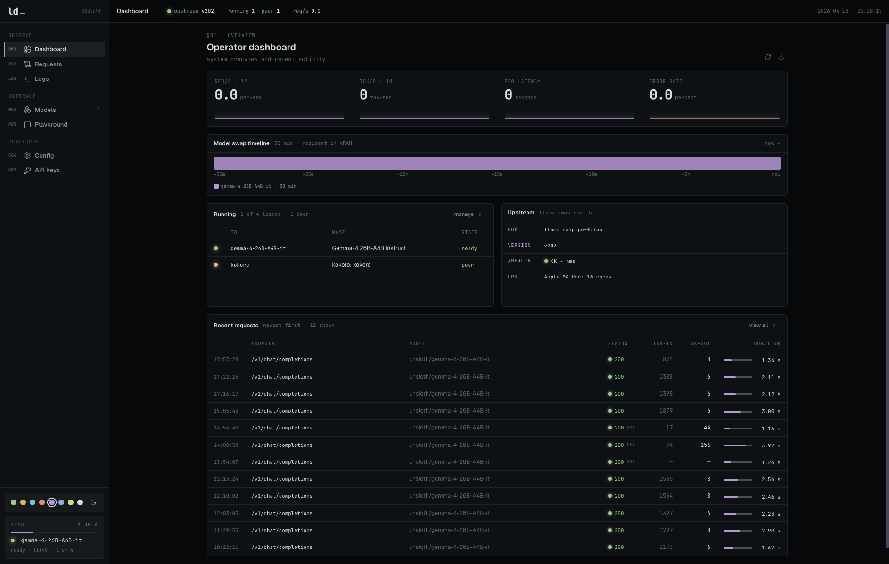
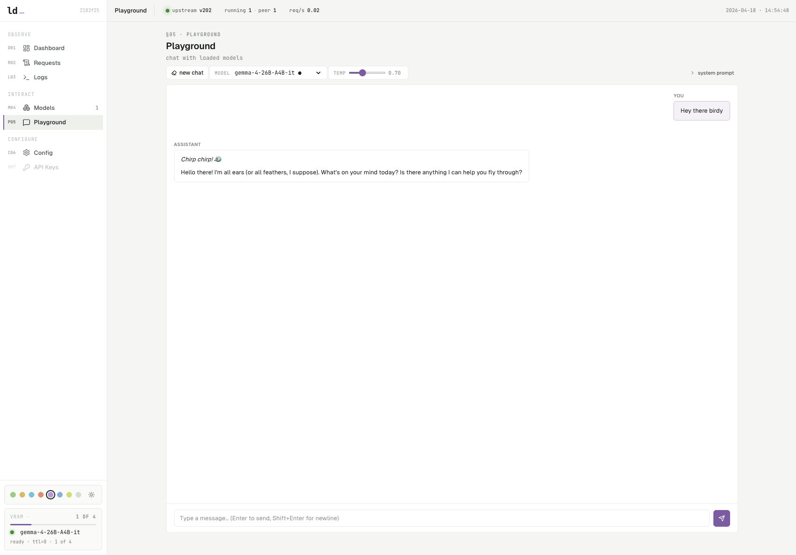
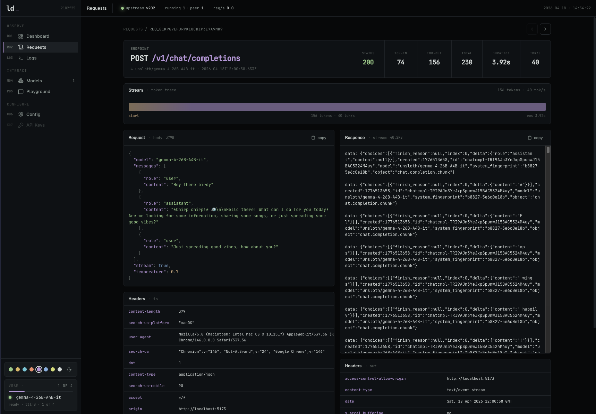

<h1>
  
  &nbsp;llama-dash
</h1>

Alternative dashboard and proxy for [llama-swap](https://github.com/mostlygeek/llama-swap). It requires a running llama-swap instance — llama-dash does not run inference itself. Clients point at llama-dash instead of llama-swap directly. We provide a Docker Compose which includes llama-swap and llama-dash and will get you up and running with both quickly.

- **Dashboard** — live stats, sparklines, model timeline, upstream health, GPU monitoring.
- **Model management** — load/unload models, per-model stats, load history, config snippet.
- **Request logging** — every `/v1/*` call logged with searchable UI, histogram, and detail view.
- **Transparent proxy** — streaming SSE preserved, token counts scraped in-flight.
- **API keys** — per-key rate limits (RPM/TPM), model allow-lists editable from detail page, hashed at rest, per-key stats and model usage breakdown.
- **Policies** — model aliases (global name mapping), per-key model pinning, per-key system prompt injection, global request size limits.
- **Request auditing** — per-key usage tracking across all proxied calls.
- **GPU monitoring** — NVIDIA, AMD, and Apple Silicon. VRAM, utilization, temp, power.
- **Config editor** — edit `config.yaml` in-browser with validation and auto-reload.
- **Endpoints** — copyable base URL, API key selector, code examples for curl, Python, TypeScript, Home Assistant, Claude Code, opencode, Continue, Open WebUI.

<table>
  <tr>
    <td align="center">
      Dashboard
    </td>
    <td align="center">
      Playground
    </td>
    <td align="center">
      Request Details
    </td>
  </tr>
  <tr>
    <td>
      
    </td>
    <td>
      
    </td>
    <td>
      
    </td>
  </tr>
</table>


## Quick start (Docker Compose)

```bash
cp config/config.example.yaml config/config.yaml  # edit models
docker compose up -d
# open http://localhost:5173
```

The compose file runs llama-swap (with `-watch-config` for hot reload) and llama-dash together. GPU models are stored in `./models/`, config in `./config/config.yaml`.

By default the compose file is set up for AMD GPUs (`/dev/kfd`, `/dev/dri`). For NVIDIA, swap the image tag to `:cuda` and uncomment the `deploy.resources` block — see comments in `docker-compose.yaml`.

## Manual setup

### Requirements

- Node 22+
- pnpm
- A reachable [llama-swap](https://github.com/mostlygeek/llama-swap) instance

### Install

```bash
cp .env.example .env   # edit LLAMASWAP_URL to point at your instance
pnpm install
pnpm db:migrate        # creates data/dash.db
pnpm dev               # http://localhost:5173
```

## Environment

Copy `.env.example` to `.env` and fill in the values.

| Var | Default | Notes |
|---|---|---|
| `LLAMASWAP_URL` | `http://localhost:8080` | Upstream llama-swap base URL. No trailing slash. |
| `LLAMASWAP_INSECURE` | `false` | Skip TLS verification for upstream with self-signed certs. |
| `LLAMASWAP_CONFIG_FILE` | (empty) | Absolute path to llama-swap's `config.yaml`. Required for config editor. |
| `DATABASE_PATH` | `data/dash.db` | SQLite file, relative to CWD. |

## How it's wired

- `src/server/proxy/*` — the `/v1/*` pass-through: streaming SSE preserved, token counts scraped from the response as it flies by, one row per request written to SQLite on completion.
- `src/server/admin/*` — the `/api/*` admin surface consumed by the UI (models, requests, stats, histogram, health, GPU, model-timeline).
- `src/server/gpu-poller.ts` — polls `nvidia-smi` / `rocm-smi` / `system_profiler` every 10s, caches result in memory. AMD APUs use GTT (not VRAM) for actual usable memory.
- `src/server/model-watcher.ts` — polls llama-swap `/running` every 15s, diffs state, writes load/unload events to `model_events` table.
- `src/server/llama-swap/client.ts` — typed client over llama-swap's HTTP API.
- `src/server/vite-plugin.ts` — mounts handlers + starts pollers as Vite dev-server middleware. Production packaging (Nitro / Docker) is not part of this first pass.
- `src/routes/*` — thin TanStack Start route entrypoints for `/`, `/models`, `/models/:id`, `/requests`, `/logs`, `/playground`, `/config`, `/keys`, `/keys/:id`, `/policies`, `/endpoints`.
- `src/features/*` — feature-local page components and helpers grouped by route area (`dashboard`, `requests`, `keys`, `models`, `playground`, etc.).
- `src/lib/queries.ts` — TanStack Query hooks with 5s polling for live updates.

## Useful scripts

```bash
pnpm dev           # dev server (:5173)
pnpm db:generate   # emit a new drizzle migration from the schema
pnpm db:migrate    # apply pending migrations
pnpm db:studio     # drizzle-kit studio

pnpm lint          # biome lint .
pnpm lint:fix      # biome lint --write .
pnpm format        # biome format .
pnpm format:fix    # biome format --write .
pnpm check         # biome check --write . (lint + format + import sort)
pnpm typecheck     # tsgo --noEmit
```

Run `lint:fix`, `format:fix`, and `typecheck` before calling any change
done — see `AGENTS.md`.

## Acknowledgements

This project was developed with significant assistance from LLMs. Architecture decisions, implementation, and documentation were all shaped through human-AI collaboration.

## License

MIT
