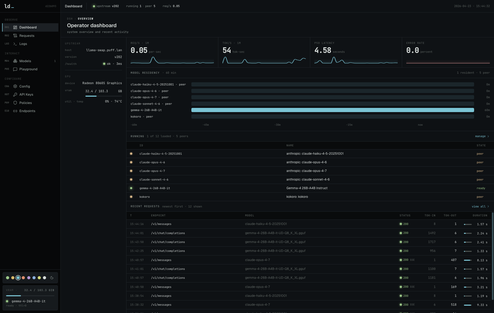
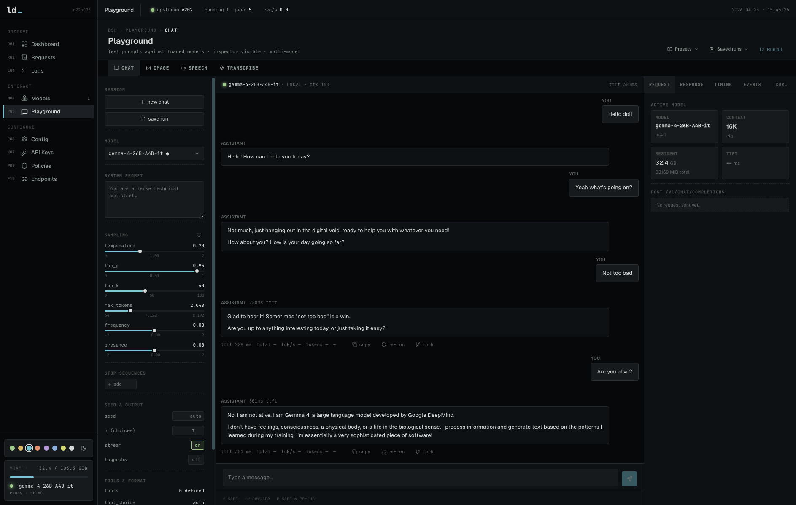
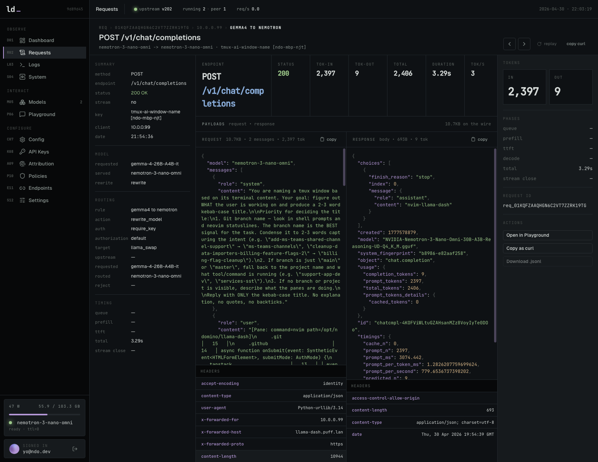
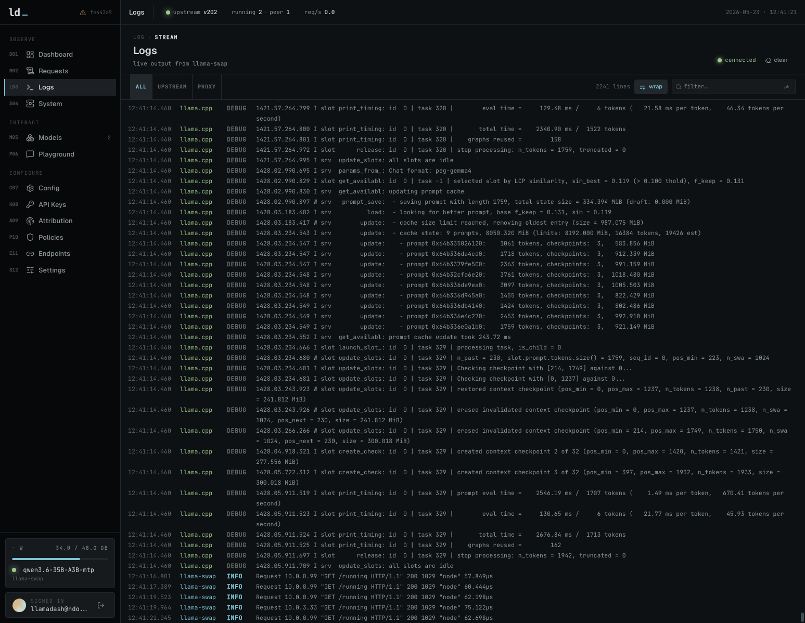
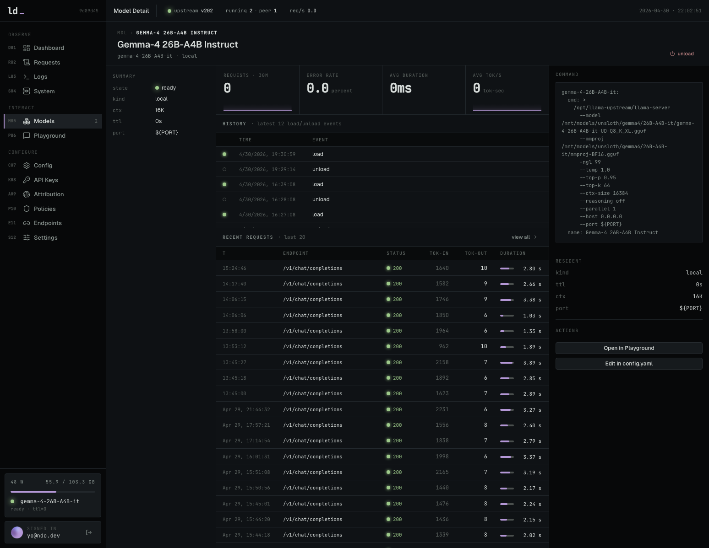
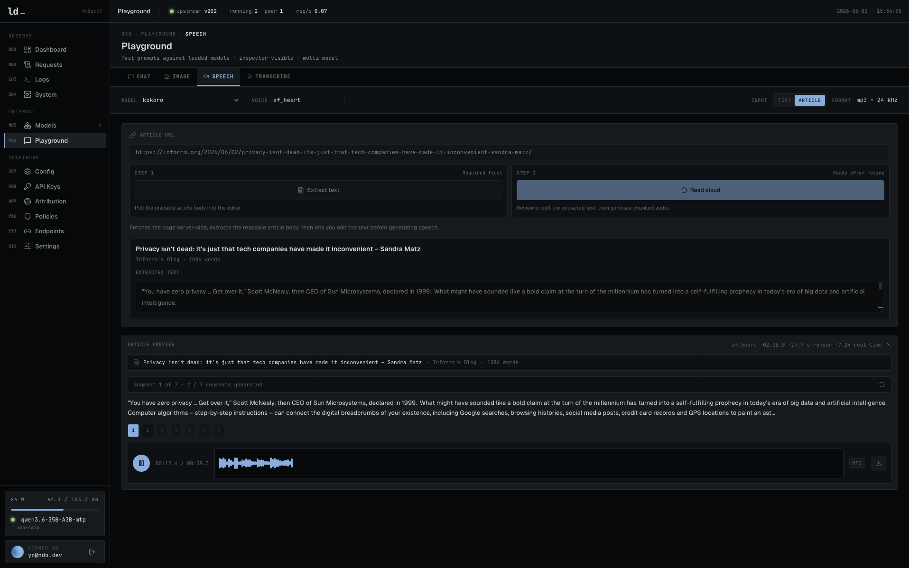
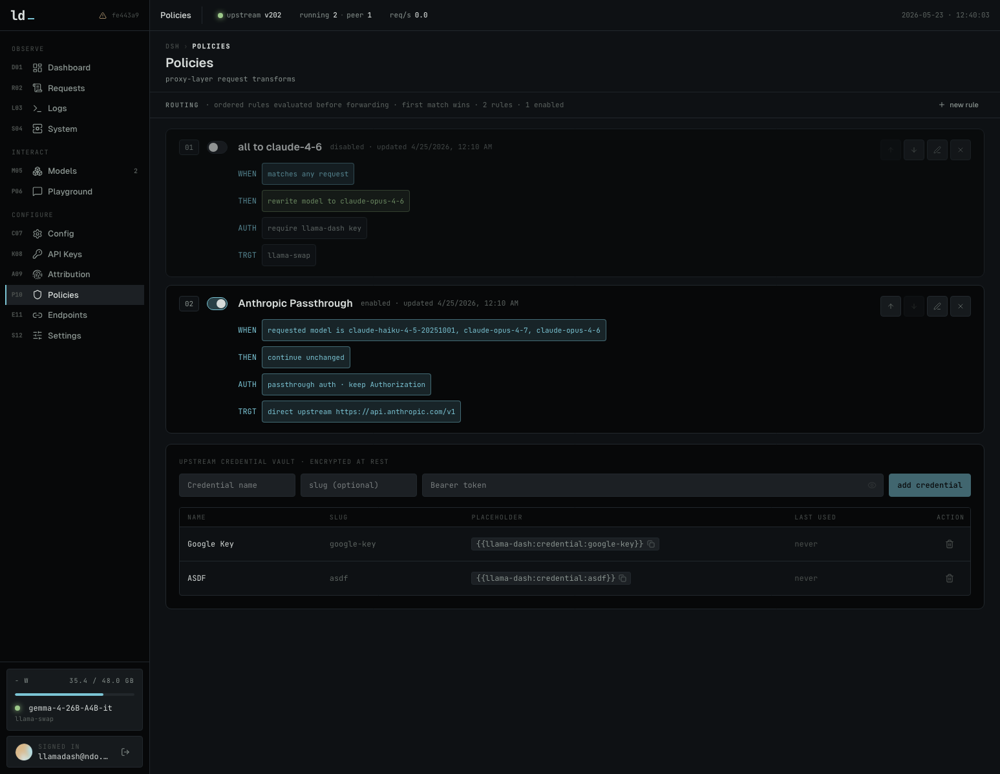
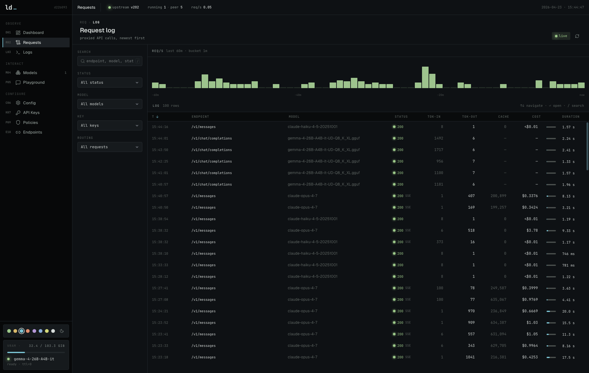

<h1>
  
  &nbsp;llama-dash
</h1>



llama-dash turns a self-hosted local inference box into an observable, policy-controlled AI gateway: one UI for model state, request history, API keys, routing rules, proxy metrics, and client setup. Two inference backends are supported: [llama-swap](https://github.com/mostlygeek/llama-swap) (bundled compose) and [llama.cpp Router Mode](https://github.com/ggml-org/llama.cpp) (`INFERENCE_BACKEND=llama-cpp-router`).

It is the single public entrypoint for OpenAI-compatible and Anthropic-compatible clients. llama-dash owns proxy policy, logging, auth, routing, and backend normalization, your selected inference backend owns local model processes and inference when traffic is routed to local models.

```text
OpenAI SDK / Claude Code / Continue / Open WebUI
                    │
                    ▼
              llama-dash :3000
      dashboard · auth · logs · routing · metrics
             │                     │
             ▼                     ▼
      inference backend          direct /v1 upstreams
  llama-swap or llama.cpp          OpenAI · Anthropic
  router mode
```

## ✨ What it does

- **Watch the box** — live request, token, model, upstream, GPU, and update status in one dashboard.
- **Manage models** — load/unload models, inspect per-model stats and capability metadata, view residency history, and edit llama-swap config with validation.
- **Proxy clients** — expose one OpenAI/Anthropic-compatible `/v1/*` endpoint for local models, peers, direct upstreams, Claude Code, Continue, Open WebUI, and more.
- **Queue local load** — bound concurrent local-backend requests, queue overflow/timeouts, and model-aware scheduling (same-model batching + fairness). Direct upstreams bypass the queue. Request/playground timing shows `queue + model loading + prefill + reasoning + response + other = total` (0/null → "—"): prefill/response from llama.cpp GPU timings, model loading from wall RELAY→REASON|RESPOND minus prefill, reasoning from REASON→RESPOND. Queue wait is also shown in the playground inspector (START → QUEUE → RELAY).
- **Track requests** — searchable request history with filters, histograms, detail views, attribution metadata, token counts, and cost estimates.
- **Control access** — dashboard login, hashed API keys, per-key RPM/TPM limits, model allow-lists, MCP relay allow-lists, and per-key usage breakdowns.
- **Enforce policy** — routing rules for model rewrites, rejects, passthrough auth, direct HTTPS upstreams, encrypted credentials, system prompts, and global request size limits.
- **Test models** — playgrounds for chat, image, speech, and transcription, including article-to-speech extraction.
- **Export ops data** — raw log streams, retention controls, request auditing, and low-cardinality Prometheus metrics at `/metrics`.

<table>
  <tr>
    <td align="center" valign="top">
      <sub><strong>Dashboard</strong><br />Live traffic, tokens, model residency, upstream and GPU health</sub>
    </td>
    <td align="center" valign="top">
      <sub><strong>Playground</strong><br />Chat against local endpoints with request/response inspection</sub>
    </td>
    <td align="center" valign="top">
      <sub><strong>Request detail</strong><br />Routing, attribution, latency, tokens, and payload metadata</sub>
    </td>
    <td align="center" valign="top">
      <sub><strong>Logs</strong><br />Raw llama-swap, proxy, and upstream streams in one viewer</sub>
    </td>
  </tr>
  <tr>
    <td valign="top">
      
    </td>
    <td valign="top">
      
    </td>
    <td valign="top">
      
    </td>
    <td valign="top">
      
    </td>
  </tr>
  <tr>
    <td align="center" valign="top">
      <sub><strong>Model detail</strong><br />Load history, stats, recent requests, and config context</sub>
    </td>
    <td align="center" valign="top">
      <sub><strong>Speech playground</strong><br />Read any article and audio testing</sub>
    </td>
    <td align="center" valign="top">
      <sub><strong>Policies</strong><br />Aliases, routing rules, passthrough auth, and request limits</sub>
    </td>
    <td align="center" valign="top">
      <sub><strong>Requests</strong><br />Searchable history with filters, sorting, and histogram</sub>
    </td>
  </tr>
  <tr>
    <td valign="top">
      
    </td>
    <td valign="top">
      
    </td>
    <td valign="top">
      
    </td>
    <td valign="top">
      
    </td>
  </tr>
</table>


## ⚡ Quick start (Docker Compose)

Choose the compose file that matches your GPU vendor. Both setups use `./config/config.yaml` for llama-swap config, `./models/` for model files, and expose llama-dash on `http://localhost:3000`.

First create your env and config files, then set the required secrets:

```bash
cp .env.example .env       # then set BETTER_AUTH_SECRET and CREDENTIAL_ENCRYPTION_KEY
cp config/config.example.yaml config/config.yaml   # edit models
```

The compose files load `.env` via `env_file` and won't start without it. Generate a session secret with `openssl rand -base64 33`. See the [Environment](#️-environment) table for all values.

### AMD / ROCm

```bash
docker compose -f docker-compose.amd.yaml up -d
```

`docker-compose.amd.yaml` runs `ghcr.io/mostlygeek/llama-swap:rocm`, passes through `/dev/kfd` and `/dev/dri`, and also mounts `/dev/dri` into llama-dash so AMD GPU stats work in the dashboard. The config directory is mounted into both services so llama-dash can atomically save `config.yaml` and llama-swap can reload it through `-watch-config`.

### NVIDIA / CUDA

```bash
docker compose -f docker-compose.nvidia.yaml up -d
```

`docker-compose.nvidia.yaml` runs `ghcr.io/mostlygeek/llama-swap:cuda` and requests `gpus: all` for the llama-swap service. This requires the NVIDIA Container Toolkit on the host. The config directory is mounted into both services so llama-dash can atomically save `config.yaml` and llama-swap can reload it through `-watch-config`.

### llama.cpp Router Mode

Use `docker-compose.router.yaml` when running `llama-server` on the host in router mode:

```bash
# On the host, start llama-server in router mode:
llama-server --models-dir ./models --port 8080 --host 0.0.0.0

# Then start llama-dash:
docker compose -f docker-compose.router.yaml up -d
```

This compose file connects `llama-dash` to your host's `llama-server` process via `host.docker.internal`. Set `INFERENCE_BACKEND=llama-cpp-router` in `.env`. Config editing is not available in this mode — model management is done through the router's REST API (`/models/load`, `/models/unload`) and the llama-dash Models UI.

## 🏗️ Manual setup

### Requirements

- Node 24+
- pnpm
- A reachable inference backend: [llama-swap](https://github.com/mostlygeek/llama-swap) or [llama.cpp](https://github.com/ggml-org/llama.cpp) in router mode

### Install

```bash
cp .env.example .env   # edit INFERENCE_BASE_URL to point at your instance
pnpm install
pnpm db:migrate        # optional preflight; also runs automatically on server boot
pnpm dev               # http://localhost:5173
```

## 🧪 Tests

```bash
pnpm test                 # unit + integration (CI)
pnpm test:unit            # co-located *.test.ts with mocked boundaries
pnpm test:integration     # :memory: SQLite + fake upstream proxy contracts
```

Shared fixtures and harness code live in `src/test/`. Both inference backends
(`llama-swap` and `llama-cpp-router`) are exercised via dummy HTTP fixtures — see
[`docs/2026_07_24_test_system.md`](./docs/2026_07_24_test_system.md).

## 🏔️ Environment

Copy `.env.example` to `.env` and fill in the values.

See the [environment variables reference](https://llama-dash.dev/docs/reference/environment-variables)
for the complete list of variables, defaults, and deployment notes.

## ✴️ Claude Code / Anthropic passthrough

Route any Anthropic SDK, including Claude Code, through llama-dash for logging,
filtering, per-request inspection, and Anthropic subscription passthrough.

See the [Claude Code & Anthropic passthrough guide](https://llama-dash.dev/docs/clients/claude-code)
for client setup, routing rules, subscription OAuth, and provider-key flows. For
remote MCP servers, see the [MCP relays guide](https://llama-dash.dev/docs/clients/mcp-relays).

## 🤖 Acknowledgements

This project was developed with significant assistance from LLMs. Architecture decisions, implementation, and documentation were all shaped through human-AI collaboration.

## 📝 License

MIT
